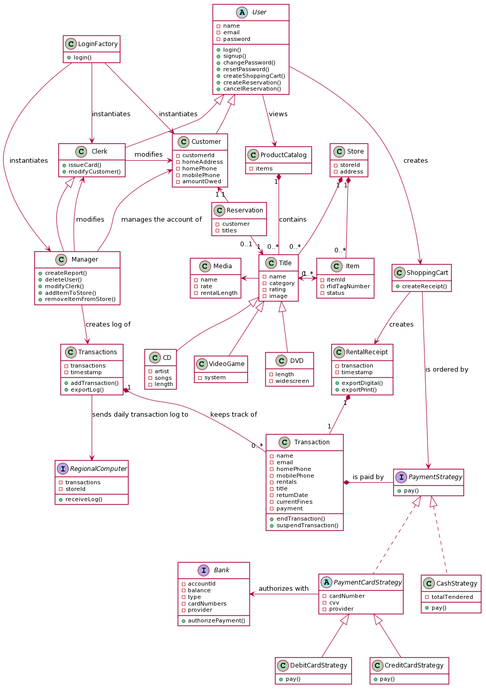

# SWEN383-Store 
## Caper

This project is for the class SWEN383 and the goal of the project was to learn the software development lifecycle, various diagramming and project planning methodologies and reflecting the planning in the implementation. 

This repository contains the frontend implementation code for the project which is inspired from [this repository](https://github.com/Vccentric/Ecommerce-Store). This included the initial React and Redux set up. The majority of the code that is written is from us the ECommerce-Store has heavily adapted but used as a template do to quick sprints and development time for this proof of concept. 

## Presentation
#### Analysis and Design 

Planning this project was relatively straight forward and easy as the requirements were nicely diagramed at the beginning of the project. We then created a SRS document which outline the functional and non-functional requirements that were necessary for the application (with a full feature set). Since we developed the application with using the Agile approach we then created User Stories (using Trello) which listed all of the acceptance criteria necessary for the story. 

Next we created UI designs in Figma as basic sketches from what the application would look like. In the SRS document we also went over error handling like if the payment does not succeed, if the login form is not properly filled out, problems with retrieving the availability of the inventory, etc. Finally foreseeable changes and enhancements were outlined. Once of the main features to be added was adding streaming services as renting of games, cd's, dvd's is dated. 

#### Implementation Challenges

Implementation was relatively easy due to the limited feature set that we had to develop. But some of the challenges were that not all of us are experienced in React. While it is a relatively easy framework to get started with and enables super fast product iterations there are a few odd quirks that are harder to wrap your head around at first. One of those is the Lifecycle of a React Component. Once that is understood React is easy to develop with. Specifically for this project it is nice because all the data about the reservation system can be stored in the React State. Meaning it is all client side and we did not have to worry about developing a server or database to hold the client information. 

Another implementation challenge was that those of us who had experience in React we did not have experience using React Hooks to manage state. Once we played around with them for a little we were comfortable and the implementation continued without a problem. 

#### Lessons learned

The main lesson that we learned was that the planning is important but we should have spent more time implementing the features. It worked out for us that it was just a Proof of Concept and we only had to implement a limited feature set. But if we had to implement all of the features diagrammed and outlined in our project planning documents than we would not have had adequate time to complete on time. Our development time was 1 week. This of course was shortened from 2 weeks due to the extended spring break from COVID-19. But even if we had 2 weeks for the implementation I am still skeptical that we could have implemented the full feature set. 

The main takeaway from this is that it is important to plan as it makes your development cycle quicker but development always takes longer than planned for no matter how much planning you do. 

#### Demo (proof of concept)
This demo provides the following functionality:

1. Login 
    
    Login with 
    ```
    User: "User"
    Password: "Password123"
    ```
    to view the site as a user and
    ```
    User: "admin"
    Password: "admin"
    ```
    to view as a manager
    
2. Manager rights of adding, removing, editing a title
3. Reserve

Below is a a UML diagram of the project to give you a quick overview of the project. Note: the demo does not include all functionality diagrammed below. 



## Other Resources
 [SRS Document](https://drive.google.com/a/g.rit.edu/file/d/1XGAXr_Ckkik8yIvG5Uwnl1x-1DIjSLuQ/view?usp=sharing)   
 [Teaming Document](https://drive.google.com/a/g.rit.edu/file/d/1hvU-wi18iwrzeJLZ02nRszjrcaW7BdJK/view?usp=sharing)  
 [Project Plan](https://drive.google.com/a/g.rit.edu/file/d/1aMlxaE_bUno8hO2u9Kv03G_IH6doFTSn/view?usp=sharing)  
 [Domain Model](https://drive.google.com/a/g.rit.edu/file/d/1KkHicVugR6lkUcIXr2KoOAdYJKbLuEDK/view?usp=sharing)   
 [Class Diagram](https://drive.google.com/a/g.rit.edu/file/d/1CyelxRdRRXFW8isPW-T6YECpIzqQodnG/view?usp=sharing)   
